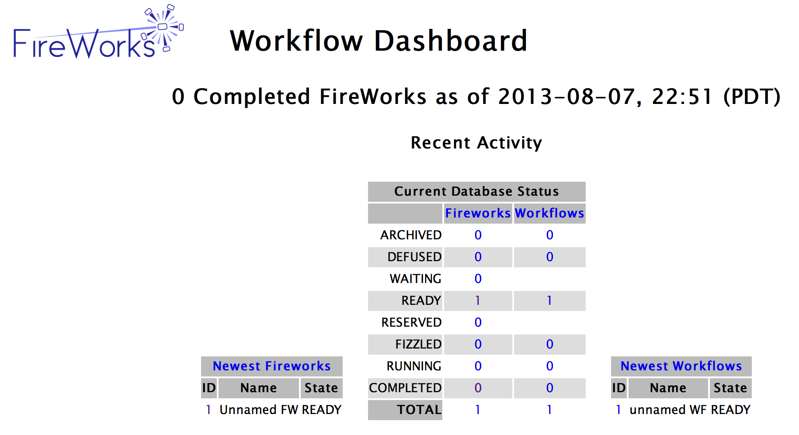

=================
Using the Web GUI
=================

An easy way to monitor FireWorks is to use its web interface, which provides an overview of the state of your workflows and provides clickable links to see details on any Firework or Workflow:

Launching the web framework
===========================

It is easy to launch the web framework using the LaunchPad::

    lpad webgui

if your LaunchPad file is automatically set via an environment variable on in the current directory (see the :doc:`config tutorial <config_tutorial>`), or::

    lpad -l my_launchpad.yaml webgui

if you need to explicitly specify the LaunchPad file to use.

The ``-s`` (or ``--server``) option runs in 'server mode', e.g. skips opening up a browser. Other options include ``--host`` and ``--port``, but you probably won't need to modify these.

Using the web framework
=======================

The current web framework is limited but simple - just click the links you are interested in. One thing to note is that the URLs can be easily modified to quickly bring up a particular Firework, e.g.::

    http://127.0.0.1:5000/fw/1/

points to the data for Firework id #1 (for the default host and port). You can easily modify this URL to check up on a particular Firework.

Authentication
==============

You can add authentication by setting the ``FWAPP_AUTH_USERNAME`` and ``FWAPP_AUTH_PASSWORD`` environment variables.