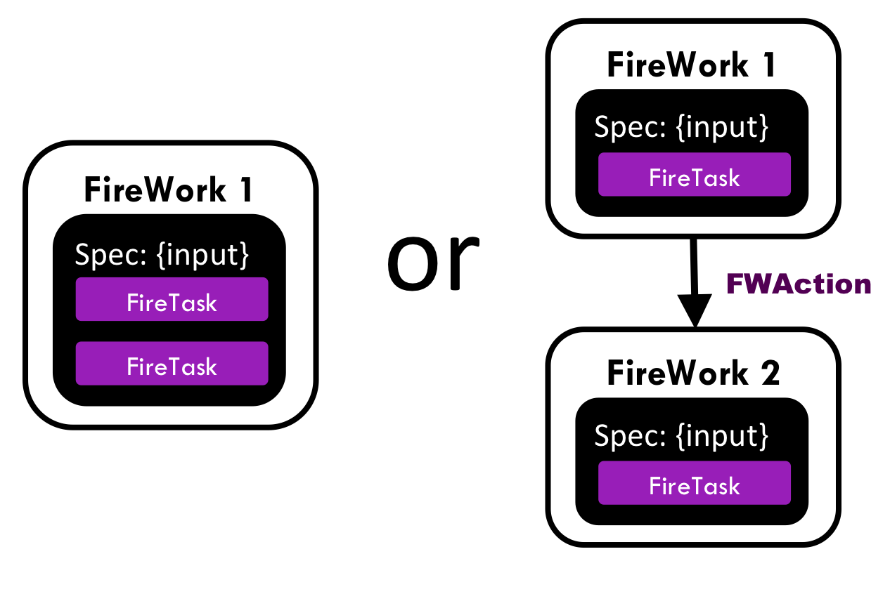

======================================================
Tips for designing FireTasks, FireWorks, and Workflows
======================================================

.. note:: For a practical introduction to writing FireTasks, see the :doc:`Guide to Writing FireTasks </guide_to_writing_firetasks>`.

Designing Firework specs
========================

Recall that the **spec** of a Firework completely bootstraps a job and determines what will run. One the major tasks as a FireWorks user is to decide how your **spec** is structured. We suggest you keep the following suggestions in mind:

#. In general, put any flexible input data as root keys in your **spec**, *outside* the ``_tasks`` section. An example of this was the ``input_array`` parameter that defined the numbers to add in our ``Addition Task`` (see the :doc:`firetask tutorial <firetask_tutorial>`).
#. Also put in the **spec** any metadata about your job that you want to query on later. You can perform rich MongoDB queries over the JSON document in the **spec**. Performance will be better for keys that are at the root of your **spec** versus nested within dicts.
#. If you are using the :doc:`duplicate check feature <duplicates_tutorial>`, also put in the spec any parameter needed to help verify that a job is truly duplicated. For example, you might provide a unique String that FireWorks can use to quickly check duplication between jobs without explicitly checking that every parameter of two jobs are the same.

.. note:: You can also put input data needed by your FireTasks *within* the ``_tasks`` section of your **spec**. For example, the ``ScriptTask`` we explored defined the ``script`` input parameter within the *_tasks* section (see the :doc:`introductory tutorial <introduction>`). Generally, this technique makes querying on your parameters more difficult and can lead to input data repetition if you have many FireTasks that need to access the same data. However, its advantage is preventing namespace collisions between parameters used in different FireTasks or if when running the same FireTask multiple times. For example, you might have multiple ``ScriptTask`` instances in your Firework, and each needs its own distinct ``script`` rather than a global parameter. The default FireTasks built into FireWorks generally allow you to choose how you want to do things; for example, see the ``_use_global_spec`` option in the :doc:`ScriptTask documentation </scripttask>`.

Multi-FireTask or Multi-Firework?
=================================

Imagine that each of your workloads involves 6 computing steps. There are many ways you could map your workload into a Workflow:

* Use 1 Firework that contains 6 FireTasks
* Use 6 FireWorks, each of which contains 1 FireTask
* Do something in between, for example 3 FireWorks that each contain 2 FireTasks each

A simplified version of the problem with 2 computing steps is shown below:

We saw an example of the "multi FireTask, single FW" solution in the :doc:`firetask tutorial <firetask_tutorial>` and the "single FireTask, multi FW" solution in the :doc:`workflow_tutorial`. Which is better?

In general, using fewer FireWorks is simpler to implement, but less powerful. We suggest that you start by trying to map your workload into a *single* Firework with multiple tasks to maximize simplicity. Then, use the following table to help decide what points of your workload would benefit from being encapsulated into its own Firework, and what parts would be cumbersome to split up.

+------------------------------------------+------------------------------------------+
| Multiple FireTasks w/in one Firework     |  Multiple FireWorks                      |
+==========================================+==========================================+
| all jobs executed on the same directory, | jobs executed in different directories,  |
| on the same machine                      | perhaps on different machines (custom)   |
+------------------------------------------+------------------------------------------+
| rerunning failed tasks is possible       | can rerun individual FW; each Firework   |
| but one must be a little more careful    | acts as a natural "checkpoint"           |
+------------------------------------------+------------------------------------------+
| all tasks receive the same spec. Cannot  | each FW can have its own spec; dynamic   |
| modify spec between tasks                | changes can be passed between FW through |
|                                          | FWAction                                 |
+------------------------------------------+------------------------------------------+
| Cannot branch workflows, tasks executed  | run any workflow shape, e.g. diamond-    |
| in serial as a linear array              | shaped branching for parallelization     |
+------------------------------------------+------------------------------------------+
| Cannot dynamically change WF between     | Can change workflow between FWs through  |
| tasks                                    | FWAction                                 |
+------------------------------------------+------------------------------------------+
| Cannot get statistics like runtime for   | Statistics like runtime recorded per FW  |
| individual tasks within a FW             |                                          |
+------------------------------------------+------------------------------------------+
| When running on queue, *all* tasks must  | Each FW can have its own batch job.      |
| be within same batch job. Means that all | Splitting workload into multiple FW can  |
| tasks must finish within the walltime    | reduce walltime needed for each FW       |
| (bad if you have walltime restrictions)  |                                          |
+------------------------------------------+------------------------------------------+
| Cannot duplicate check each FireTask     | Each FW within a workflow can be checked |
| individually                             | for duplication with past runs           |
+------------------------------------------+------------------------------------------+

What you might notice is that the FireWorks codebase treats the "Firework" object to be the atomic computing job. Jobs are launched, tracked, restarted, and duplicate-checked at the Firework level. The FireTasks are a convenience that let you simplify some of the overhead associated with having many FireWorks, especially when you want to run many tasks in the same directory and on the same machine. However, not many features are available at the FireTask level.

The end is just the beginning
=============================

You've made it to the end of the workflows tutorial! By now you should have a good feeling for the basic operation of FireWorks and the types of automation it allows. However, it is certainly not the end of the story. Job priorities, duplicate job detection, and running through queues are just some of the features we haven't discussed in the core tutorial.

If you haven't already set up Worker computing resources to execute your jobs, you might do that now by following the :doc:`Worker tutorial <worker_tutorial>`. Otherwise, you might return to the :doc:`home page <index>` and choose what topic to pursue next.