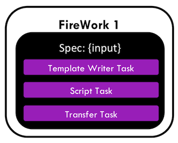
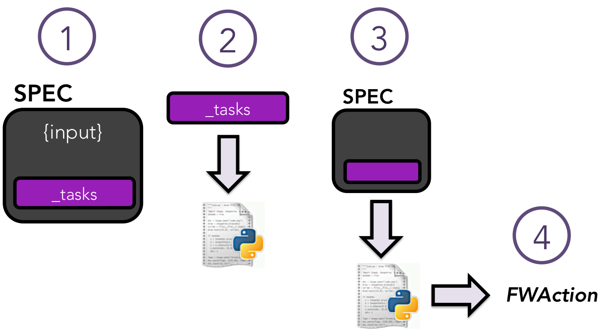

=============================
Defining Jobs using FireTasks
=============================

This tutorial shows you how to:

* Run multiple tasks within a single Firework
* Run tasks that are defined within a Python function, rather than a shell script

This tutorial can be completed from the command line, but some knowledge of Python is helpful. In this tutorial, we will run examples on the central server for simplicity. One could just as easily run them on a FireWorker if you've set one up.

Introduction to FireTasks
=========================

In the :doc:`Introductory tutorial <introduction>`, we ran a simple script that performed ``echo "howdy, your job launched successfully!" >> howdy.txt"``. Looking inside ``fw_test.yaml``, recall that the command was defined within a task labeled ``ScriptTask``::

    spec:
      _tasks:
      - _fw_name: ScriptTask
        script: echo "howdy, your job launched successfully!" >> howdy.txt

The ``ScriptTask`` is one type of *FireTask*, which is a predefined job template written in Python. The ``ScriptTask`` in particular refers Python code inside FireWorks that runs an arbitrary shell script that you give it. You can use the ``ScriptTask`` to run almost any job (without worrying that it's all done within a Python layer). However, you might want to set up jobs that are more powerful than shell scripts using Python programming. Later in this section, we'll demonstrate how to accomplish this with custom *FireTasks*. However, first we'll demonstrate the simplest version to linearly run multiple tasks.

Running multiple FireTasks
==========================

You can run multiple tasks within the same Firework (it might be helpful to review the :ref:`wfmodel-label` diagram). For example, the first step of your Firework might write an input file that the second step reads and processes. Finally, a third step might move the entire output directory somewhere else on your filesystem (or a remote server).

Let's create a Firework that:

#. Writes an input file based on a *template* with some substitutions applied. We'll do this using a built-in ``TemplateWriterTask`` that can help create such files.
#. Executes a script using ``ScriptTask`` that reads the input file and produces some output. In our test case, it will just count the number of words in that file. However, this code could be any program, for example a chemistry code.
#. Copies all your outputs to your home directory using ``FileTransferTask``.

The three-step Firework thus looks like this:

1. Navigate to the tasks tutorial directory on your FireServer::

    cd <INSTALL_DIR>/fw_tutorials/firetask

#. Look inside the file ``fw_multi.yaml``::

    spec:
      _tasks:
      - _fw_name: TemplateWriterTask
        context:
          opt1: 5.0
          opt2: fast method
        output_file: inputs.txt
        template_file: simple_template.txt
      - _fw_name: ScriptTask
        script: wc -w < inputs.txt > words.txt
        use_shell: true
      - _fw_name: FileTransferTask
        files:
        - dest: ~/words.txt
          src: words.txt
        mode: copy

   There are now three tasks inside our **spec**: the ``TemplateWriterTask``, ``ScriptTask``, and ``FileTransferTask``. The ``TemplateWriterTask`` will load an example template called ``simple_template.txt`` from inside the FireWorks code, replace certain portions of the template using the ``context``, and write the result to ``input.txt``. Next, the ``ScriptTask`` runs a word count on ``input.txt`` using the ``wc`` command and print the result to ``words.txt``. Finally, ``FileTransferTask`` will copy the resulting output file to your home directory.

   .. note:: If you would like to know more about how templated input writing works and define your own templated files, you should consult the :doc:`TemplateWriterTask tutorial <templatewritertask>`. A copy of ``simple_template.txt`` is given in the directory as ``simple_template_copy.txt`` (however, modifying the copy won't modify the actual template).

   .. note:: The ``FileTransferTask`` can do much more than copy a single file. For example, it can transfer your entire output directory to a remote server using SSH. For details, see the :doc:`FileTransferTask docs <fileiotasks>`.

#. Run this multi-step Firework on your FireServer::

	 lpad reset
	 lpad add fw_multi.yaml
	 rlaunch singleshot

You should see two files written out to the system, ``inputs.txt`` and ``words.txt``, confirming that you successfully ran the first two steps of your job! You can also navigate to your home directory and look for ``words.txt`` to make sure the third step also got completed correctly.

This combination of writing a file, executing a command, and perhaps moving the results could be used in many situations. For example, you could use ``TemplateWriterTask`` to write a templated queue script, and then use the ``ScriptTask`` to submit it (e.g., via the *qsub* command). (note, however, that FireWorks provides more powerful methods to :doc:`submit jobs through queues </queue_tutorial>`). Or, you could use the ``TemplateWriterTask`` to write an input file, the ``ScriptTask`` to execute a code that can read that input file, and finally the ``FileTransferTask`` to move the results somewhere.

.. note:: The only way to communicate information between FireTasks within the same Firework is by writing and reading files, such as in our example. If you want to perform more complicated information transfer, you might consider :doc:`defining a workflow <workflow_tutorial>` that connects FireWorks instead. You can pass information easily between different FireWorks in a Workflow through the *FWAction* object, but not between FireTasks within the same Firework (:ref:`wfmodel-label`).

Python Example (optional)
-------------------------

Here is a complete Python example that runs multiple FireTasks within a single Firework::

    from fireworks import Firework, FWorker, LaunchPad, ScriptTask, TemplateWriterTask, FileTransferTask
    from fireworks.core.rocket_launcher import launch_rocket

    # set up the LaunchPad and reset it
    launchpad = LaunchPad()
    launchpad.reset('', require_password=False)

    # create the Firework consisting of multiple tasks
    firetask1 = TemplateWriterTask({'context': {'opt1': 5.0, 'opt2': 'fast method'}, 'template_file': 'simple_template.txt', 'output_file': 'inputs.txt'})
    firetask2 = ScriptTask.from_str('wc -w < inputs.txt > words.txt')
    firetask3 = FileTransferTask({'files': [{'src': 'words.txt', 'dest': '~/words.txt'}], 'mode': 'copy'})
    fw = Firework([firetask1, firetask2, firetask3])

    # store workflow and launch it locally, single shot
    launchpad.add_wf(fw)
    launch_rocket(launchpad, FWorker())

.. _customtask-label:

Creating a custom FireTask
==========================

The ``TemplateWriterTask``, ``ScriptTask``, ``FileTransferTask`` are built-into FireWorks and can be used to perform useful operations. In fact, they might be all you need! In particular, because the ``ScriptTask`` can run arbitrary shell scripts, it can in theory run any type of computation and is an 'all-encompassing' FireTask. ScriptTask also has many additional features that are covered in the :doc:`ScriptTask tutorial <scripttask>`.

However, if you are comfortable with some basic Python, you can define your own custom FireTasks for the codes you run. A custom FireTask gives you more control over your jbos, clarifies the usage of your code, and guards against unintended behavior by restricting the commands that can be executed.

Even if you plan to only use the built-in tasks, we suggest that you still read through the next portion before continuing with the tutorial. We'll be creating a custom FireTask that adds one or more numbers using Python's ``sum()`` function, and later building workflows using this (and similar) FireTasks.

How FireWorks bootstraps a job
------------------------------

Before diving into an example of custom FireTask, it is worth understanding how FireWorks is bootstrapping jobs based on your specification. The basic process looks like this:

1. The first step of the image just shows how the **spec** section of the Firework is structured. There is a section that contains your FireTasks (one or many), as we saw in the previous examples. The **spec** also allows you to define arbitrary JSON data (labeled *input* in the diagram) to pass into your FireTasks as input. So far, we haven't seen an example of this; the only information we gave in the spec in the previous examples was within the **_tasks** section.

2. In the second step, FireWorks dynamically loads Python objects based on your specified **_tasks**. It does this by searching a list of Python packages for Python objects that have a value of *_fw_name* that match your setting. When we set a *_fw_name* of ``ScriptTask`` in the previous examples, FireWorks was loading a Python object with a *_fw_name* class variable set to ``ScriptTask`` (and passing the ``script`` parameter to its constructor). The ``ScriptTask`` is just one type of FireTask that's built into FireWorks to help you run scripts easily. You can write code for custom FireTasks anywhere in the **user_packages** directory of FireWorks, and it will automatically be discovered. If you want to place your FireTasks in a package outside of FireWorks, please read the :doc:`FireWorks configuration tutorial <config_tutorial>`. You will just need to define what Python packages to search for your custom FireTasks, or use a special format that allows for direct loading of classes.

3. In the third step, we execute the code of the FireTask we loaded. Specifically, we execute the ``run_task`` method which must be implemented for every FireTask. FireWorks passes in the *entire* spec to the ``run_task`` method; the ``run_task`` method can therefore modify its behavior based on any input data present in the spec, or by detecting previous or future tasks in the spec.

4. When the FireTask is done executing, it returns a *FWAction* object that can modify the workflow (or continue as usual) and pass information to downstream FireWorks.

Custom FireTask example: Addition Task
--------------------------------------

Let's explore custom FireTasks with an example: a custom Python script for adding two numbers specified in the **spec**.

1. Staying in the firetasks tutorial directory, remove any output from the previous step::

    rm howdy.txt FW.json words.txt

#. Let's first look at what a custom FireTask looks like in Python. Look inside the file ``addition_task.py`` which defines the ``Addition Task``::

    class AdditionTask(FireTaskBase, FWSerializable):

        _fw_name = "Addition Task"

        def run_task(self, fw_spec):
            input_array = fw_spec['input_array']
            m_sum = sum(input_array)

            print("The sum of {} is: {}".format(input_array, m_sum))

            return FWAction(stored_data={'sum': m_sum})

#. A few notes about what's going on (things will be clearer after the next step):

   * In the class definition, we are extending *FireTaskBase* to tell FireWorks that this is a FireTask.
   * A special parameter named *_fw_name* is set to ``Addition Task``. This parameter sets what this FireTask will be called by the outside world and is used to bootstrap the object, as described in the previous section. If we did not set this ourselves, the default would have been ``fireworks:AdditionTask`` (the root module name plus the class name separated by a colon).
   * The ``run_task()`` method is a special method name that gets called when the task is run. It can take in a Firework specification (**spec**) in order to modify its behavior.
   * When executing ``run_task()``, the AdditionTask we defined first reads the **input_array** parameter of the Firework's **spec**. It then sums all the values it finds in the **input_array** parameter of the Firework's **spec** using Python's ``sum()`` function. Next, the FireTask prints the inputs and the sum to the standard out. Finally, the task returns a *FWAction* object.
   * We'll discuss the FWAction object in greater detail in future tutorials. For now, it is sufficient to know that this is an instruction that says we should store the sum we computed in the database (inside the Firework's ``stored_data`` section).

#. Now let's define a Firework that runs this FireTask to add the numbers ``1`` and ``2``. Look inside the file ``fw_adder.yaml`` for this new Firework definition::

    spec:
      _tasks:
      - _fw_name: Addition Task
        parameters: {}
      input_array:
      - 1
      - 2

#. Let's match up this Firework with our code for our custom Firework:

   * The *_fw_name* parameter is set to the same value as in our code for the FireTask (``Addition Task``). This is how FireWorks knows to run your custom FireTask rather than ``ScriptTask`` or some other FireTask.
   * This **spec** has an **input_array** field defined to ``1`` and ``2``. Remember that our Python code was grabbing the values in the **input_array**, summing them, and printing them to standard out.

#. When you are comfortable that you roughly understand how a custom FireTask is set up, try running the Firework on the central server to confirm that the ``Addition Task`` works::

	lpad reset
	lpad add fw_adder.yaml
	rlaunch --silencer singleshot

   .. note:: The ``--silencer`` option suppresses log messages.

#. Confirm that the *sum* is not only printed to the screen, but also stored in our Firework in the ``stored_data`` section::

    lpad get_fws -i 1 -d all

should contain in its output a section that looks like this::

    ...
    "action": {
        "update_spec": {},
        "mod_spec": [],
        "stored_data": {
            "sum": 3
        },
    ...

Writing your own custom FireTasks
=================================

If you'd like to attempt writing your own FireTask, a guide to doing so can be found :doc:`here <guide_to_writing_firetasks>`.

Python example (optional)
=========================

Here is a complete Python example that runs a custom FireTask::

    from fireworks import Firework, FWorker, LaunchPad
    from fireworks.core.rocket_launcher import launch_rocket
    from fw_tutorials.firetask.addition_task import AdditionTask

    # set up the LaunchPad and reset it
    launchpad = LaunchPad()
    launchpad.reset('', require_password=False)

    # create the Firework consisting of a custom "Addition" task
    firework = Firework(AdditionTask(), spec={"input_array": [1, 2]})

    # store workflow and launch it locally
    launchpad.add_wf(firework)
    launch_rocket(launchpad, FWorker())

Next up: Workflows!
===================

With custom FireTasks, you can go beyond the limitations of running shell commands and execute arbitrary Python code templates. Furthermore, these templates can operate on data from the **spec** of the Firework. For example, the ``Addition Task`` used the ``input_array`` from the **spec** to decide what numbers to add. By using the same Firework with different values in the **spec** (try it!), one could execute a data-parallel application.

While one could construct an entire workflow by chaining together multiple FireTasks within a single Firework, this is often not ideal. For example, we might want to switch between different FireWorkers for different parts of the workflow depending on the computing requirements for each step. Or, we might have a restriction on walltime that necessitates breaking up the workflow into more atomic steps. Finally, we might want to employ complex branching logic or error-correction that would be cumbersome to employ within a single Firework. The next step in the tutorial is to explore :doc:`connecting together FireWorks into a workflow <workflow_tutorial>`.