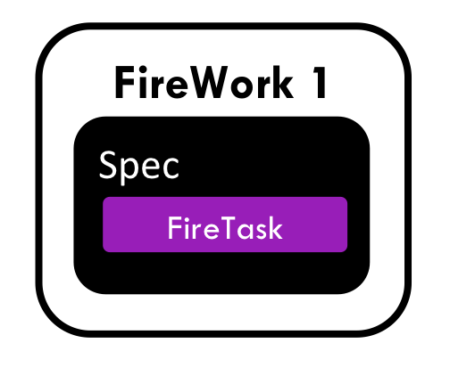

=====================
Introductory Tutorial
=====================

In this tutorial, you will:

* Add a simple workflow to the central database via a file
* Run that workflow in a few modes
* Get a flavor of the Python API

The purpose of this tutorial is to get you set up as quickly as possible; it isn't intended to demonstrate the features of FireWorks or explain things in great detail. This tutorial can be safely completed from the command line, and requires no programming.

.. important:: If you are having trouble with this tutorial, please post a message on the `FireWorks Github page <https://github.com/materialsproject/fireworks/issues>`_.

Reset/Initialize the FireServer
-------------------------------

#. If not already running, start MongoDB::

    mongod --logpath <FILENAME_TO_LOG_TO> --fork

   .. note::  If you cannot access the ``/data/db`` directory or if you are running MongoDB on a shared machine, make sure that the ``--dbpath` variable is set to a directory that you can access or set the appropriate permissions.

   .. note:: If MongoDB is outputting a lot of text, you might want to start it in a dedicated Terminal window or use the ``--quiet`` option. You may also wish to set up your Mongo config in a file and use the --config option.

   .. note:: If your MongoDB database is located on a different computer from your FireWorks installation, navigate to the computer containing the FireWorks installation and type ``lpad init``. This will set up a file that points to your remote database. You can now run ``lpad`` commands from within this directory. Alternatively, use the ``lpad -l`` option to point to this file or set up this file as your default db location using the :doc:`FW config </config_tutorial>`.

#. Navigate to the FireWorks introduction directory::

    cd <INSTALL_DIR>/fw_tutorials/introduction

   where <INSTALL_DIR> is your FireWorks installation directory.

   .. note:: If you do not know your <INSTALL_DIR>, use the command ``lpad version`` to print it to the terminal. If you used the `pip` installation, you'll need to download the tutorial files separately as explained in the :doc:`Basic FireWorks Installation </installation>`.

#. Reset the FireWorks database (the LaunchPad)::

    lpad reset

   .. note:: If you are already curious about the various options that the LaunchPad offers, you can type ``lpad -h`` or ``lpad reset -h``. The ``-h`` help option is available for all of the scripts and sub-commands (like ``reset``) in FireWorks. For example, if you ``lpad reset`` using the ``--password`` option set to today's date, e.g. 2012-02-01, you can bypass the prompt asking you to confirm the reset.

Add a Firework to the FireServer database
-----------------------------------------

A Firework contains a list of computing tasks (FireTasks) to be performed. For this tutorial, we will use a Firework that consists of only a single step. We'll tackle more complex workflows in other tutorials. Our workflow consisting of one Firework and one FireTask thus looks like this:

#. Staying in the tutorial directory, run the following command::

    lpad add fw_test.yaml

#. This command added a simple workflow to the database which was serialized into a file called ``fw_test.yaml``. This workflow is just a single step that print some text to a file. Look inside ``fw_test.yaml`` with a text editor to see how that workflow was defined::

    spec:
      _tasks:
      - _fw_name: ScriptTask
        script: echo "howdy, your job launched successfully!" >> howdy.txt

   If you've ever used other XML-based workflow systems, you might be surprised at how succinctly a workflow can be defined in FireWorks. This specification is all that FireWorks needs to bootstrap your computing job. Later in this tutorial, we'll provide more details and demonstrate how to add a workflow within Python code (rather than files).

#. You should have received confirmation that the Firework got added. You can query the database for this Firework as follows::

    lpad get_fws -i 1 -d all

   This prints, in JSON format, *all* details of the Firework with ``fw_id`` = 1 (the first Firework entered into the database)::

    {
        "fw_id": 1,
        "state": "READY",
        "name": "Unnamed FW",
        "created_on": "2013-06-10T00:06:48.645253",
        "spec": {
            "_tasks": [
                {
                    "_fw_name": "ScriptTask",
                    "script": "echo \"howdy, your job launched successfully!\" >> howdy.txt"
                }
            ]
        }
    }

#. Some of the Firework is straightforward, but a few sections deserve further explanation:

* The **spec** of the Firework contains *all* the information about what job to run and the parameters needed to run it.
* Within the **spec**, the **_tasks** section tells you what jobs will run. The ``ScriptTask`` is a particular type of task that runs commands through the shell. Other sections of the **spec** can be also be defined, but for now we'll stick to just **_tasks**. Later on, we'll describe how to run multiple **_tasks** or customized **_tasks**.
* This Firework runs the script ``echo "howdy, your job launched successfully!" >> howdy.txt"``, which prints text to a file named ``howdy.txt``.
* The **state** of *READY* means the Firework is ready to be run.
* The **name** is an optional field that we can set to help query for FireWorks later on. In this case, we did not specify one so a default name was used.

You have now stored a Firework in the LaunchPad, and it's ready to run!

.. note:: The ScriptTask provides more options than what's presented here; more details on using the ``ScriptTask`` can be found :doc:`here <scripttask>`.
.. note:: The ``lpad get_fws`` command is a powerful way to search for FireWorks in the database. For details on its usage, see :doc:`Querying FireWorks and Workflows </query_tutorial>`

Launch a Rocket on the FireServer
=================================

A Rocket fetches a Firework from the LaunchPad and runs it. A Rocket might be run on a separate machine (FireWorker) or through a queuing system. For now, we will run the Rocket on the FireServer itself and without a queue.

1. We can launch Rockets using the Rocket Launcher. Execute the following command (once)::

    rlaunch singleshot

   The Rocket fetches an available Firework from the FireServer and runs it.

#. Verify that the desired task ran::

    cat howdy.txt

   You should see the text: ``howdy, your job launched successfully!``

.. note:: In addition to ``howdy.txt``, you should also see a file called ``FW.json``. This contains a JSON representation of the Firework that the Rocket ran and can be useful later for tracking down a launch or debugging.

#. Check the status of your Firework::

    lpad get_fws -i 1 -d all

   You will now see lots of information about your Rocket launch, such as the time and directory of the launch. A lot of it is probably unclear, but you should notice that the state of the Firework is now ``COMPLETED``.

#. Try launching another rocket::

    rlaunch singleshot

   The message ``No FireWorks are ready to run and match query!`` indicates that the Rocket tried to fetch a Firework from the database, but none could be found. Indeed, we had previously run the only Firework that was in the database.

Launch many Rockets (rapidfire mode)
====================================

If you just want to run many jobs on the central server itself, the simplest way is to run the Rocket Launcher in "rapidfire mode". Let's try this feature:

#. Staying in the same directory, clean up your output files::

    rm FW.json howdy.txt

#. Let's add 3 identical FireWorks::

    lpad add fw_test.yaml
    lpad add fw_test.yaml
    lpad add fw_test.yaml

#. Confirm that the three FireWorks got added to the database, in addition to the one from before (4 total)::

    lpad get_fws -d less

#. We could also just get information for jobs that are ready to run (our 3 new FireWorks)::

    lpad get_fws -s READY -d less

#. Let's run launch Rockets in "rapidfire" mode, which will keep repeating until we run out of FireWorks to run::

    rlaunch rapidfire

#. You should see three directories starting with the tag ``launcher_``. Inside each of these directories, you'll find the results of one of your FireWorks (a file named ``howdy.txt``)::

    cat launch*/howdy.txt

Running FireWorks automatically
===============================

We can set our Rocket Launcher to continuously look for new FireWorks to run. Let's try this feature.

#. Staying in the same directory, clean up your previous output files::

    rm -r launcher_*

#. Start the Rocket Launcher so that it looks for new FireWorks every 10 seconds::

    rlaunch rapidfire --nlaunches infinite --sleep 10

#. **In a new terminal window**, navigate back to your working directory containing ``fw_test.yaml``. Let's insert two FireWorks::

    lpad add fw_test.yaml
    lpad add fw_test.yaml

#. After a few seconds, the Rocket Launcher should have picked up the new jobs and run them. Confirm this is the case::

    cat launch*/howdy.txt

   You should see two outputs, one for each Firework we inserted.

#. You can continue adding FireWorks as desired; the Rocket Launcher will run them automatically and create a new directory for each job. When you are finished, you can exit out of the Rocket Launcher terminal window and clean up your working directory.

#. As with all FireWorks scripts, you can run the built-in help for more information::

    rlaunch -h
    rlaunch singleshot -h
    rlaunch rapidfire -h

What just happened?
===================

It's important to understand that when you add a Firework to the LaunchPad using the ``lpad`` script, the job just sits in the database and waits. The LaunchPad does not submit jobs to a computing resource when a new Firework is added to the LaunchPad. Rather, a computing resource must *request* a computing task by running the Rocket Launcher.

By running the Rocket Launcher from different locations, you can have different computing resources run your jobs. Using rapidfire mode is a convenient way of requesting multiple jobs using a single command.

Python Examples (optional)
=========================

While it's possible to work operate FireWorks using YAML or JSON files, a much cleaner mode of operation is to use Python scripts. For example, here is a runnable script that creates our LaunchPad, defines our test Workflow, and runs it::

    from fireworks import Firework, LaunchPad, ScriptTask
    from fireworks.core.rocket_launcher import launch_rocket

    # set up the LaunchPad and reset it
    launchpad = LaunchPad()
    launchpad.reset('', require_password=False)

    # create the Firework consisting of a single task
    firetask = ScriptTask.from_str('echo "howdy, your job launched successfully!"')
    firework = Firework(firetask)

    # store workflow and launch it locally
    launchpad.add_wf(firework)
    launch_rocket(launchpad)

.. note:: You must have MongoDB running locally on port 27017 for the above example to work. Otherwise, see below.

Here a few modifications that you might already find useful.

Change the MongoDB configuration::

    launchpad = LaunchPad(host="myhost", port=12345, \
    name="fireworks_testing_db", username="my_user", \
    password="my_pass")

Run in rapid-fire mode::

    from fireworks.core.rocket_launcher import rapidfire
    rapidfire(launchpad, FWorker())  # use this line instead of launch_rocket()

Only output warnings and above::

    launchpad = LaunchPad(strm_lvl='WARNING')
    # <code omitted>
    launch_rocket(launchpad, FWorker(), strm_lvl='WARNING')

Write out the Workflow to a flat file, or load a Firework object from a file::

    fw_yaml = firework.to_file("my_firework.yaml")
    fw = firework.from_file("my_firework.yaml")
    print fw

    fw_json = firework.to_file("my_firework.json")
    fw = firework.from_file("my_firework.json")
    print fw

.. note:: The *to_file()* and *from_file()* functions are available for many Firework objects, including the LaunchPad and Workflows (which are covered in a later tutorial). Technically, any class in FireWorks that subclasses *FWSerializable* (which is most of them) will allow serialization/deserialization to files if desired.

.. note:: FireWorks automatically detects what type of format you're writing and reading from based on the extension. Both JSON and YAML are fully supported. Of course, if you're using Python, there may not be any need to use files at all!

The code above generally does not use a lot of the optional arguments to keep the examples looking clean and sharp. You might experiment with some of the options - for example, to set up logging when initializing the LaunchPad or control the parameters of rapid-fire mode. You can see the additional arguments by browsing the :doc:`modules documentation </modules>`.

Next steps
==========

At this point, you've successfully stored a simple job in a database and run it later on command. You even executed multiple jobs with a single command: ``rlaunch rapidfire``, and looked for new jobs automatically using the **infinite** Rocket Launcher. This should give a basic feeling of how you can automate many jobs using FireWorks.

However, we still haven't covered many important topics. For example, we have not executed complex workflows, run arbitrary Python code, or run jobs on different types of computing resources. Nor have we really looked into how to monitor and manage jobs and deploy FireWorks in production.

We suggest that you continue by learning how to :doc:`define jobs using FireTasks </firetask_tutorial>`. Alternatively, you could return to the :doc:`home page </index>` and choose a tutorial topic that suits your application.