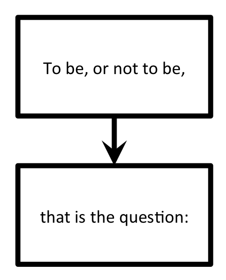

==================
Creating Workflows
==================

In this tutorial, we'll explore how to:

* connect together multiple FireWorks into Workflows

This tutorial can be completed from the command line. In this tutorial, we will run examples on the central server for simplicity. One could just as easily run them on a FireWorker if you've set one up.

The simplest workflow
=====================

The simplest workflow consists of two jobs without any data dependency between them. The only constraint is that the second job should be executed after the first.

For example, we might want print the first two lines of Hamlet's soliloquy to the standard out (e.g., your Terminal window). We can represent the workflow with the following diagram:

Basically, we just want to ensure that *"To be, or not to be,"* is printed out before *"that is the question:"*. Let's define and execute this workflow.

1. Move to the ``workflow`` tutorial directory on your FireServer::

    cd <INSTALL_DIR>/fw_tutorials/workflow

#. The workflow is encapsulated in the ``hamlet_wf.yaml`` file. Look inside this file. The first section, labeled ``fws``, contains a list of Firework objects:

    * We define a Firework with ``fw_id`` set to 1, and that prints *"To be, or not to be,"*.
    * We define another Firework with ``fw_id`` set to 2, and that prints *"that is the question:"*

    The second section, labeled ``links``, connects these FireWorks into a workflow:

    * In the ``links`` subsection, we are specifying that the child of FW with id 1 is the FW with id 2. This means hold off on running *"that is the question:"* until we've first run *"To be, or not to be,"*.

#. Let's insert this workflow into our database::

    lpad reset
    lpad add hamlet_wf.yaml

   .. note:: When you insert the Workflow into the database using the LaunchPad, the LaunchPad will echo back an ``id_map`` that tells you how ``fw_ids`` were reassigned. The value of the ``fw_id`` has no meaning or effect on the operation of FireWorks.

#. Let's look at our two FireWorks::

    lpad get_fws -i 1 -d all
    lpad get_fws -i 2 -d all

#. You should notice that the Firework that writes the first line of the text (*"To be, or not to be,"*) shows a state that is *READY* to run. In contrast, the Firework that writes the second line is not yet *READY*. The second line will not run until the first line is complete.

#. Let's run the just first step of this workflow, and then examine the state of our FireWorks::

    rlaunch -s singleshot

   .. note:: The ``-s`` option is a shortcut to the ``--silencer`` option that suppresses log messages.

#. You should have seen the text *"To be, or not to be"* printed to your standard out. Let's examine our FireWorks again to examine our new situation::

    lpad get_fws -i 1 -d more
    lpad get_fws -i 2 -d more

#. We see now that the first step is ``COMPLETED``, and the second step has automatically graduated from ``WAITING`` to ``READY``.

#. Let's now launch a Rocket that will run the second Firework of this Workflow::

    rlaunch -s singleshot

#. This should print the second step of the workflow (*"That is the question"*). You can verify that both steps are completed::

    lpad get_fws -i 1 -d less
    lpad get_fws -i 2 -d less

.. note:: Shakespeare purists will undoubtedly notice that I have mangled the first line of this soliloquy by splitting it into two lines. But at least we printed them in the correct order!

A Diamond Workflow
==================

Let's continue with a very similar example, but make the workflow a little more intricate. We will now print the org chart of a company. Of course, CEOs should be printed before managers, and managers before interns:

.. image:: _static/org_wf.png
   :width: 400px
   :align: center
   :alt: Org chart WF

Let's quickly define and execute this workflow.

1. Stay in the same ``workflow`` tutorial directory on your FireServer and clean it up::

    cd <INSTALL_DIR>/fw_tutorials/workflow
    rm FW.json

#. The workflow is encapsulated in the ``org_wf.yaml`` file. Look inside this file.

    * The ``fws`` section should make sense - we have defined one Firework for each position in the company (4 in total).
    * The ``links`` section should also make sense. The CEO has two children (the managers). The managers each have the same child (the intern). (The company appears to be quite the oligarchy!)

#. Once everything makes sense, let's add the workflow and run everything at once::

    lpad reset
    lpad add org_wf.yaml
    rlaunch -s rapidfire

#. You should notice that the CEO correctly gets printed above the managers, who in turn are printed above the intern. There is no preference amongst the two managers as written; FireWorks might print either manager first. If you want to distinguish between them, you can use :doc:`priorities <priority_tutorial>`.

#. Finally, you can clean up your rapid directory if you are not interested in saving the contents of each launch::

    rm -r launcher_*

Python example (optional)
-------------------------

Here is a complete Python example that runs a Workflow::

    from fireworks import Firework, Workflow, FWorker, LaunchPad, ScriptTask
    from fireworks.core.rocket_launcher import rapidfire

    # set up the LaunchPad and reset it
    launchpad = LaunchPad()
    launchpad.reset('', require_password=False)

    # define four individual FireWorks used in the Workflow
    task1 = ScriptTask.from_str('echo "Ingrid is the CEO."')
    task2 = ScriptTask.from_str('echo "Jill is a manager."')
    task3 = ScriptTask.from_str('echo "Jack is a manager."')
    task4 = ScriptTask.from_str('echo "Kip is an intern."')

    fw1 = Firework(task1)
    fw2 = Firework(task2)
    fw3 = Firework(task3)
    fw4 = Firework(task4)

    # assemble Workflow from FireWorks and their connections by id
    workflow = Workflow([fw1, fw2, fw3, fw4], {fw1: [fw2, fw3], fw2: [fw4], fw3: [fw4]})

    # store workflow and launch it locally
    launchpad.add_wf(workflow)
    rapidfire(launchpad, FWorker())

Next steps
==========

Neither our *Hamlet* workflow nor our diamond workflow were particularly interesting; you could have achieved the same result by :doc:`running multiple FireTasks within a single Firework <firetask_tutorial>`. Indeed, the single-Firework solution with multiple FireTasks is conceptually much simpler than defining workflows. The design choice of using FireTasks versus a Workflow in such scenarios is discussed another tutorial. For example, you might want to use a Workflow if each step requires a different type of computing resource.

Meanwhile, you can continue on to the last step of this tutorial series, which better illustrates the power of workflows: :doc:`Dynamic workflows <dynamic_wf_tutorial>`.